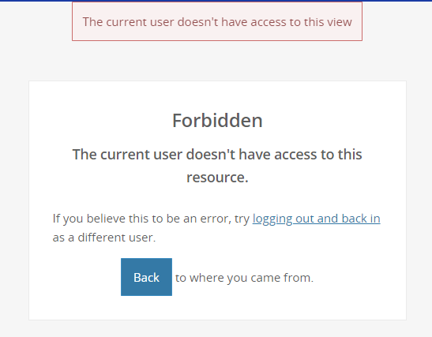
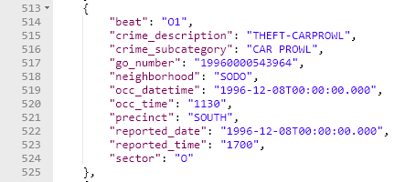
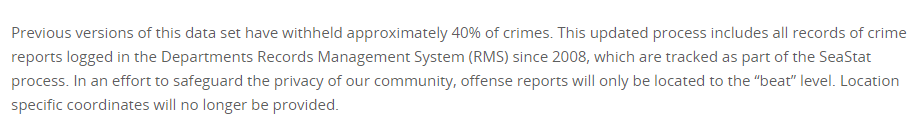
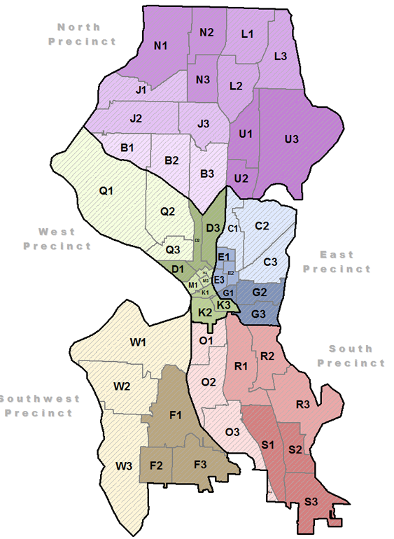
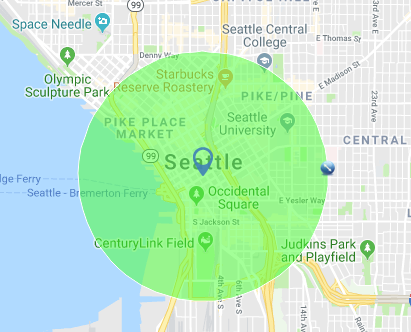

## [Demo](http://socrata.ciciliostudio.com/)

### Disclaimer

There are two contributers listed. Lately, I have been using my girlfriend's old laptop (because mine broke), which has caused me to accidentally commit under the wrong author. Please ignore this.

# Data Driven Experience

This uses the data about _building permits_ provided by Socrata. The experience allows the user to filter out permits by time and cost. 

This allows the user to see that latest developments or maybe the most costly developments.

When the user has finished filtering, they can **Explore**. Just hit the "explore" button at the top and fly to a random building permit. The details of the permit will then appear.

# The Story

The idea is that the user creates a story. It was difficult for me to come up with a story that revolves around building permits. A few story titles that came to mind are as follows:

1. Areas with new development and grow!
2. Big cost, Big desision.
3. What's new coming to town?

In the end, the development time took longer than previously thought. So I went with the idea of exploring the city. There isn't much of a story with this, but it allows the user to create their own story, and explore many ideas that may come to mind. This lets them descover the previous ideas without having to explicitly direct the user with a story.

Try it out, see what you think.

# Dev Setup

1) Clone or Download the repo.
1) Download yarn: [Yarn](https://yarnpkg.com/en/)
1) Download parcel: [Parcel](https://parceljs.org/)
1) Run `yarn install` in a terminal.
1) Run `parcel index.html` in a terminal.

* It will host this webapp on `port 1234`.

# Initial Issues

## Data Provided but not Accessible

The data url provided at " https://data.seattle.gov/PublicSafety/Seattle-Police-Department-911-Incident-Response/3k2p-39jp
" was unaccessible even with an account. The page showed the following error.

;

## Data that has the Information Needed

**Crime Data**: https://data.seattle.gov/Public-Safety/Crime-Data/4fs7-3vj5?_ga=2.57437162.1742915471.1537729638-1047274212.1537729638

This crime data no longer contains _latitude_ and _longitude_. Instead it contains precincts, sectors, and beats. Here is an example of the data below.

### The Reason Why

# Precinct, Sectors, and Beats

Precint and Beat Location Information: https://data.seattle.gov/Public-Safety/Seattle-Police-Department-Beats/nnxn-434b

Converted SPD_Beats.kmz file to .geojson file at:
https://mygeodata.cloud

Found Beats and Precinct info at: http://www.seattle.gov/police/information-and-data/tweets-by-beat

The plan is to use the two maps below to find out which beats are mostly inside of the 1 mile radius, and only include them in the SoQl query.

## Desision - Building Permits

In the end, I went with the building permit data. The building permit data contained latitude and longitude, which were easier to use than the beats and sectors.
